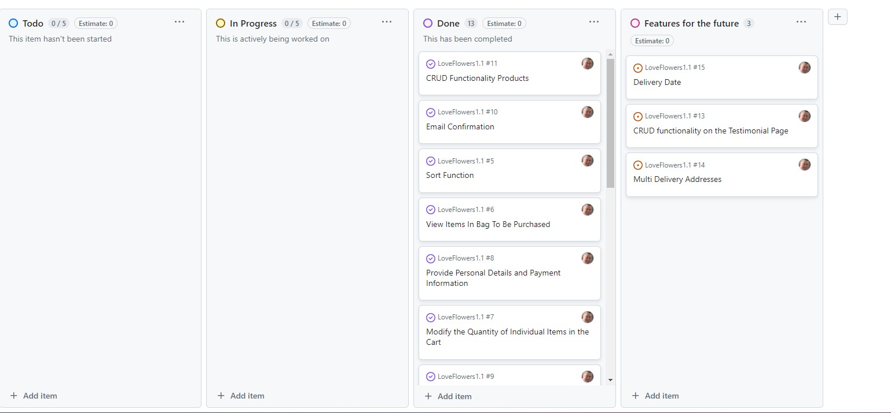
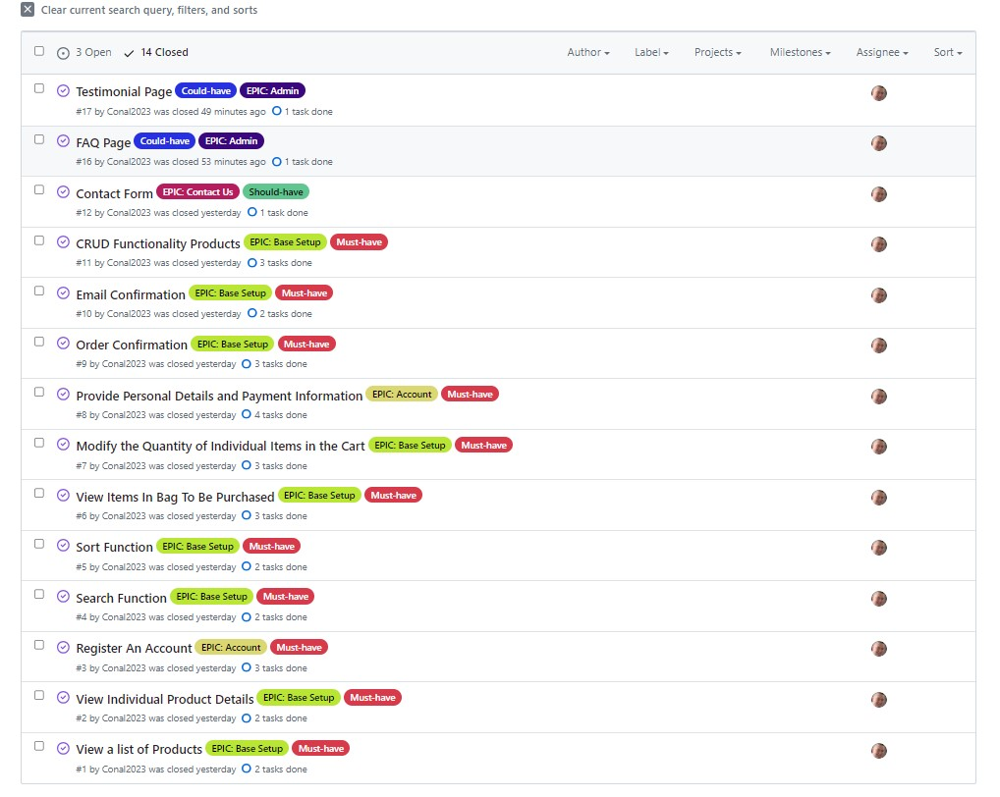

# LoveFlowers.ie - AGILE Process

This project utilised the GitHub Projects Tool to create the Scrum Board and Implement AGILE methodology.

[Scrum Board](https://github.com/users/Conal2023/projects/15)

## Epics

This Project has 5 epics:

 - Account

 - Admin

 - Base Setup

 - Contact US

 - Future Features

[EPICS](https://github.com/Conal2023/LoveFlowers1.1/issues?q=is%3Aissue+is%3Aclosed)

## Labels

This project emplyed labels for Epics and priority (MoSCow) to organise the developement process. 