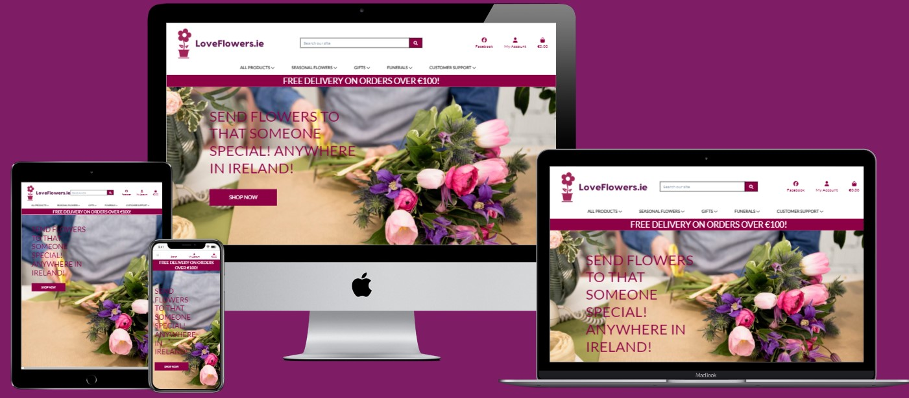
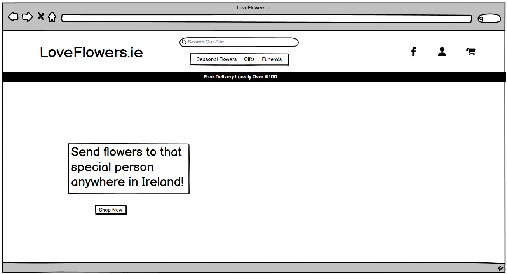
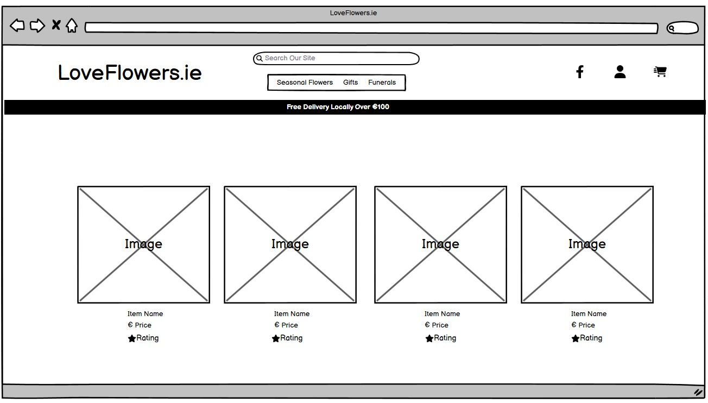
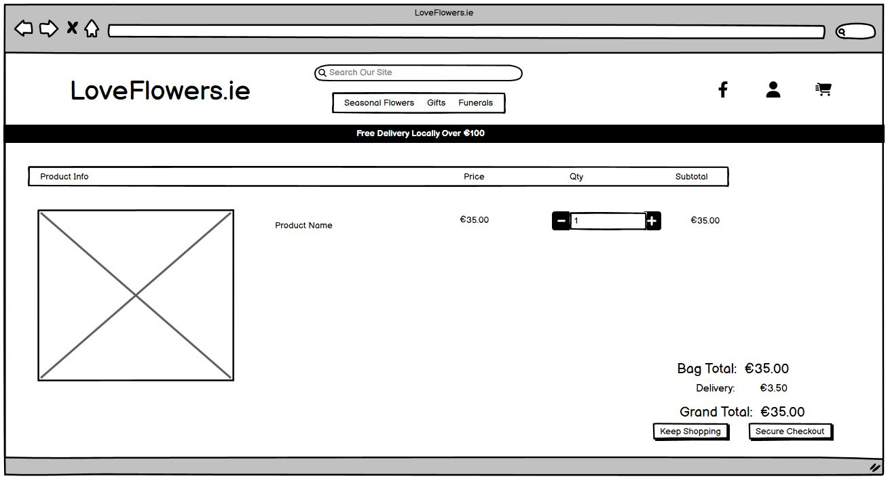
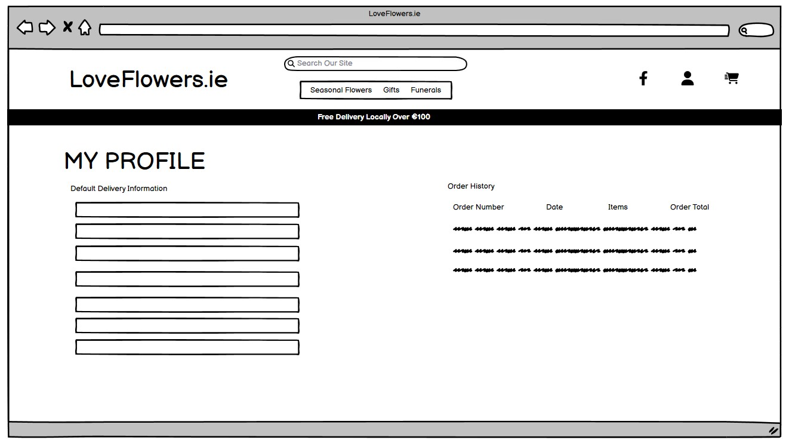
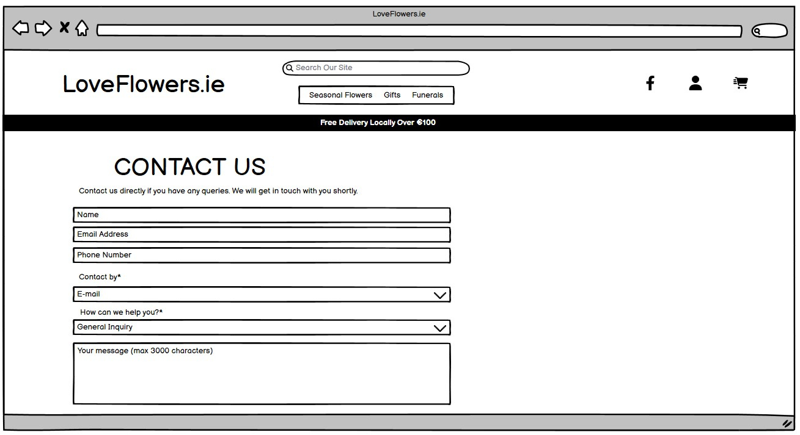
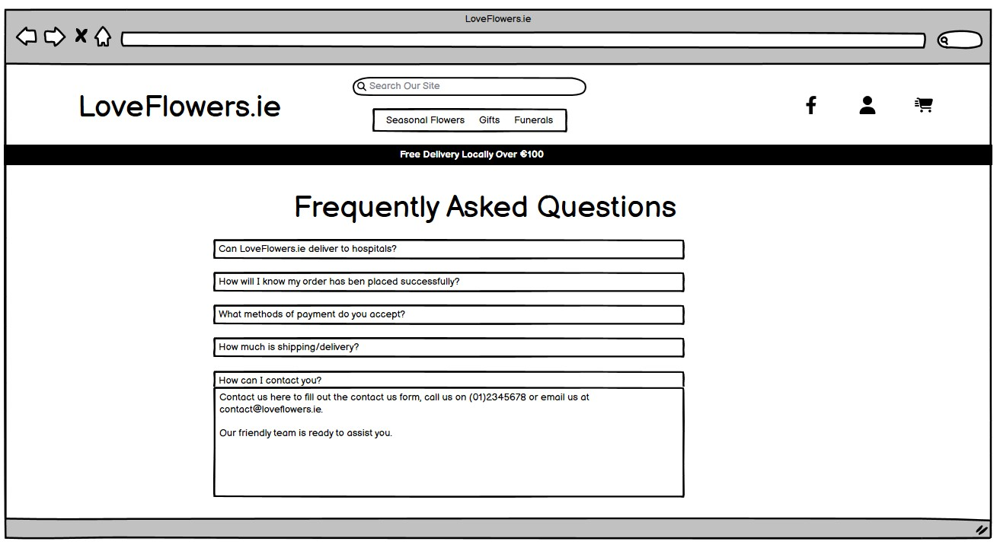
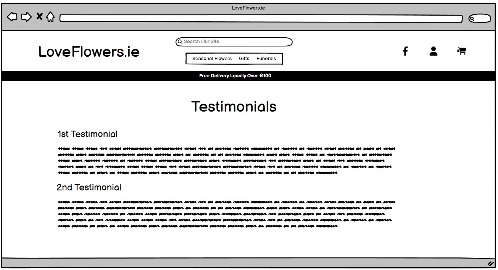
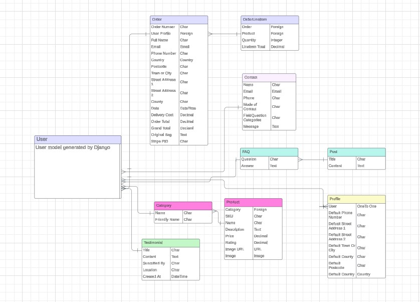
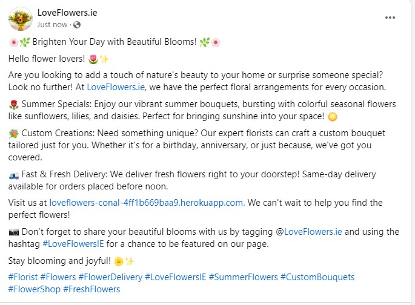

# LoveFlowers.ie

LoveFlowers.ie is a modern e-commerce platform connecting users with local florists throughout Ireland. Users can effortlessly purchase flowers online via LoveFlowers.ie, leaving all arrangements in capable hands! 

You can [access the deployed LoveFlowers.ie site on Heroku here](https://loveflowers-conal-4ff1b669baa9.herokuapp.com/)

## User Experience (UX)

Visitors to this website can expect:

 -  A user-friendly florist website designed for customers to effortlessly explore and discover information about available floral products and services.

 - A platform where users can browse and select floral products that best suit their needs and preferences.

 - A section where users can easily contact the florist page for any inquiries or questions they may have.

 - A section featuring frequently asked questions (FAQs) along with detailed responses to provide users with quick answers to common queries.

 - A section showcasing testimonials from other users, sharing their experiences and feedback about the florist's products and services.

## Plannning and Design

### Site Objective

The goal of the LoveFlowers.ie site is to offer a contemporary and user-friendly e-commerce platform where users can easily purchase floral products. The florist site includes essential features like a contact page for easy communication, a frequently asked questions section to address common queries, and a testimonial page where customers can share their feedback and experiences. Additionally, there is a newsletter sign-up form provided to gather email addresses for receiving updates on promotions and special offers.

### Scope

#### Must Have:

 - User Registration (Sign Up).

 - User Authentication (Sign In/Sign Out).

 - Admin Panel for managing products with CRUD functionality (Create, Read, Update, Delete).

 - User-friendly Navigation.

 - A Contact Form enabling users to communicate with the website's admin.

 - A Frequently Asked Questions (FAQ) page where users can find answers to commonly asked questions.

 - A Testimonials page where users can read reviews and testimonials left by other customers.

#### Should Have:

 - View Products.

 - Add Products to basket.

 - Modify or delete products in basket.

 - A fully functional checkout process where customer orders are securely processed and completed.

#### Could Have:

 - Functionality that enables users to submit their testimonials directly through the website.

 - Functionality that allows florists to sign up as partners on the website, enabling them to receive and fulfill orders placed through the platform.

 - Functionality that allows users to manage multiple delivery addresses for their orders on the website. 

#### Wont have:

 - Comments section on product pages. 

 - Sign up page for Florist to sign up as a partner.

## Agile

I employed the Agile methodology to develop and track my User Stories, utilizing issues to monitor project progress. You can access the Agile process in a separate file titled [AGILE.md](AGILE.md).

## User Stories

 - As an Admin I can...
    
    - As a Site Admin, I can manage the product listings, enabling me to create, edit, or delete products.

    - As a Site Admin, I can manage the Testimonial listings, allowing me to create, edit, or delete testimonials submitted by users.

    - As a Site Admin, I can view contact messages sent by users and reply to them using their preferred contact method. 

 - As a Site User I can...

    - As a Site User I can view and understand what the purpose of the website is.

    - As a Site User I can view products on the website.

    - As a Site User, I can open the FAQ page and view all questions and answers.

    - As a Site User I can register as a user for the site.

    - As a Site User, once registered, I can view my profile, update my details, and view my order history. 

###  Future Features

 - As a Site User, I will be able to manage multiple addresses for delivery purposes.

 - As a Site User, I will be able to submit a testimonial directly through the testimonial page. 

## Design 

All wireframes were designed through [Balsamiq](https://balsamiq.com/)

  
Home

   

  

  
Products

   

  

  
Checkout

   

  

  
Profile

   

  

  
Contact

   

  

  
FAQ

   

  

  
Testimonials

   

  

### Database Schema

 - The user model was established using Django-Allauth

  

### Business Model 

The chosen business model for this e-commerce site is B2C (Business to Consumer). LoveFlowers.ie was created with the goal of providing a convenient way for customers to order and receive flower deliveries anywhere in Ireland. By using LoveFlowers.ie, customers can avoid the hassle of searching for a local florist. Once an order is placed through our platform, we promptly contact our closest partner florist, who expertly prepares the arrangement and ensures it is delivered right to your door, ensuring a seamless and delightful experience for our customers.

Our goal is to establish the largest flower delivery network in Ireland and subsequently expand into the UK and Europe. We aim to establish a presence in every county, collaborating closely with local florists to deliver exceptional service to our customers.

### Market Strategy

To boost LoveFlowers.ie presence on social media, a Facebook page was established. E-commerce thries on Facebook by maintaining consistent posts, engaging with isers, conducting polls for feedback, and hosting competitions to attract both new and returning users. 

[LoveFlowers.ie Facebook Page](https://www.facebook.com/profile.php?id=61562084902681)

### SEO (Search Engine Optimisation)

SEO or Search Engine Optimisation is a process in which to improve your websites visibility so that there is a higher chance of a user coming across the website when searching for terms which fall in line with your websites description and keywords.

To ensure that the site had a high SEO rating the following was done: 

- Implement meta keywords and descriptions to ensure more hits for the site when users are searching for puzzles online.
- Through using [XML-Sitemaps](https://www.xml-sitemaps.com/) a sitemap was created using the final deployed version of LoveFlowers.ie. This was created to help provide the most important pages for LoveFlowers.ie to enhance its visibility on search engines.
- Finally a robots.txt file was created to advise which parts of the site could and could not be accessed by search engine crawlers.

### Logo

After realising that a plain colour background wouldn't suffice, I concluded that a simple heading wouldn't suffice either. Thus, I embarked on the task of creating a distinctive one. I turned to Google to discover a suitable website and proceeded to desgin a custom image for the heading. [looka.com](https://looka.com/editor/189305791) 

### Favicon

After integrating the logo into the header, I realised that the website wouldn't feel fully finished without a corresponding Favicon. To accomplish this, I utilised [favicon.io](https://favicon.io/) to generate a Favicon using the identical image as the logo.

## Features

For Features please go to [FEATURES.md](FEATURES.md).

## Testing

For testing results please go to [TESTING.md](TESTING.md).

## Deployment

For Deployment instructions please got to [DEPLOYMENT.md](DEPLOYMENT.md).

## Technologies Used 

### Programming Languages Used

  - HTML
  - CSS
  - JavaScript
  - Python

### Software Used

For this project the following was used:

* [Balsamiq](https://balsamiq.com/) to create all the wireframes.

* [GitHub](https://github.com/) to store all the project files.

* [Gitpod](https://gitpod.io/) used as the IDE for development.

* [Django](https://www.djangoproject.com/) utilised as the Pyhton Framework.

* [Heroku](https://www.heroku.com/) to deploy the website.

* [ElephantSL](https://www.elephantsql.com/) to host the database.

* [Cloudinary](https://cloudinary.com/) to store images for blog posts.

* [Django-allauth](https://docs.allauth.org/en/latest/) for the creation of accounts.

* [Amazon-AWS](https://aws.amazon.com/) was used host all static and media files for the site.

* [Django Crispy Forms](https://django-crispy-forms.readthedocs.io/en/latest/) employed for creating forms based on the models.

* [Gunicorn](https://gunicorn.org/) employed as the web server to host Django on Heroku.

* [Bootstrap](https://getbootstrap.com/) employed for layout design. 

* [Lucid.app](https://lucid.app/users/login#/login) to create the Database Schema

* [Tablesgenerator](https://www.tablesgenerator.com/) to help creat the tables for the manual testing in TESTING.md. 

## Credits

  - The Code Institute Boutique Ado Project had an impact on this Project. There may be some similarities in the code but I tried to stray as much as possible away from it. 

  -  [w3schools](https://www.w3schools.com/) was very helpful when I had queries on how to fix issues or if I was getting an error. 

  - [PythonGuides](https://pythonguides.com/contact-form-with-django-and-sqlite/) was used to help create the contact pages.

  - My mentor [David Bowers](https://github.com/dnlbowers) for all the help and support he has provided over the past 12 months. Honestly, if it weren't for him, I don't think I would have finished the course.
  - Finally, I want to express my gratitude to my amazing wife and two daughters. They not only supported my decision to pursue this course but also encouraged and pushed me to do my best. They listened to my frustrations and provided the motivation to keep going.