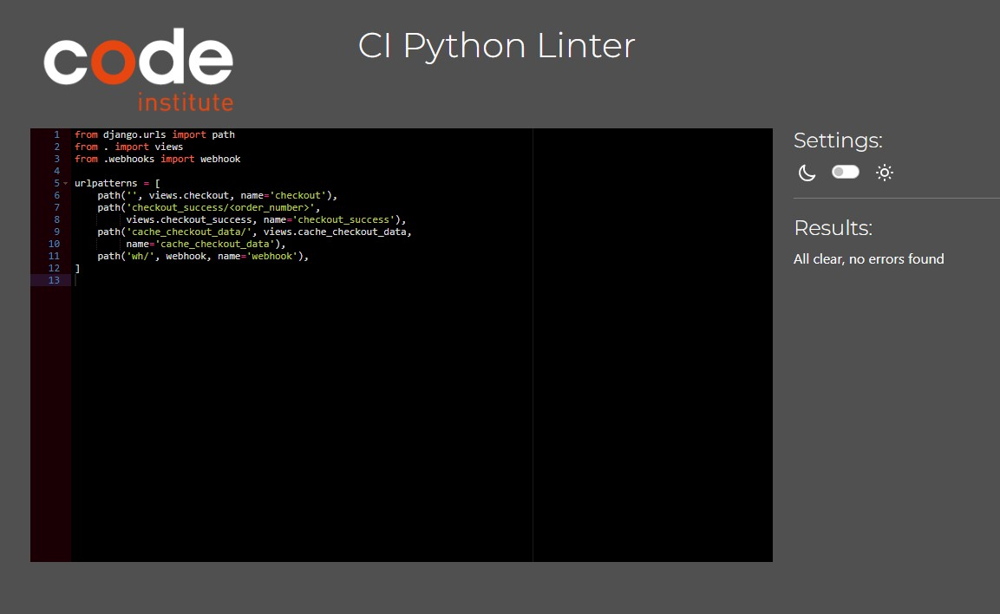
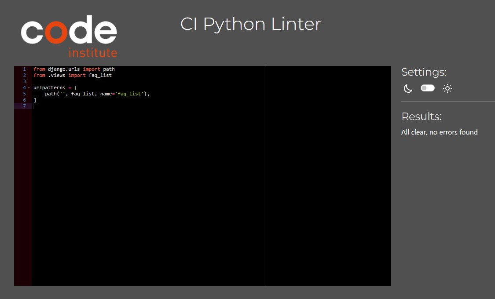

# LoveFlowers.ie - Testing

## Validation 

### HTML

The HTML was inspected by accessing the page source and copying the code into the [W3C Validator](https://validator.w3.org/). This was done for all pages. Only a few errors where found and most of these were corrected. There was 2 errors though that could'nt be corrected - see Add/Edit Products Pages below. 

 - Add/Edit Product Pages

    Here Duplicate Error ID was encountered from using custom clearable inputs form the CI Tutorial. 
    
    

### CSS

The CSS for all CSS files was validated using [Jigsaw Validator](https://jigsaw.w3.org/css-validator/).

### Javascript

All the JavaScript was tested and validated using [JSHint](https://jshint.com/) with only two errors being found and one fixed. The one not fixed I was advised to leave as is. 

#### Base.js

#### Bag.js

#### Stripe_elements.js

#### Faq.js

#### Add_product.js

#### Edit_product.js

#### Products.js

#### Quantity_input_script.js

#### Countryfields.js

### CI Python Linter

#### LoveFlowers

- Settings.py
    * The errors recorded are linked to Django Validators and can't be amended. 

    

- Urls.py

    

- Views.py

    

#### Bag

- Apps.py

    

- Contexts.py

    

- Urls.py

    

- Views.py

    

#### Checkout

- Admin.py

    

- Apps.py

    

- Forms.py

    

- Models.py

    

- Signals.py

    

- Urls.py

    

- Views.py

    

- Webhook_handler.py

    

- Webhooks.py

    

#### Contact 

- Admin.py

    

- Apps.py

    

- Forms.py

    

- Models.py

    

- Views.py

    

#### FAQ

- Admin.py

    

- Apps.py

    

- Models.py

    

- Urls.py

    

- Views.py 

    

#### Home

- Apps.py

    

- Urls.py

    

- Views.py

    

#### Products

- Admin.py

    

- Apps.py

    

- Forms.py

    

- Models.py

    

- Urls.py

    

- Views.py

    

- Widgets.py

    

#### Profiles

- Apps.py

    

- Forms.py

    

- Models.py

    

- Urls.py

    

- views.py

    

#### Testimonials

- Admin.py

    

- Apps.py

    

- Models.py

    

- Urls.py

    

- Views.py

    

### Manual Testing

`Nav Bar`

|   Feature  |                                               Expected Outcome                                             |                  Test Performed                 |                           Result                          | Test Outcome |
|:----------------:|:-----------------------------------------------------------------------------------------------------------------:|:-----------------------------------------------------:|:----------------------------------------------------------------:|:------------------:|
|       Logo       |                                                 Goes to Home page                                                 |                   Click on the Logo                   |                   Brings the user to Home Page                   |        Pass        |
|   All Products   |   Drop down appears to filter by, once filter is clicked brings you to all products filtered by filter selected   |        Click on All Products and select filter        |   Brings user to All Products Page filtered to selected filter   |        Pass        |
| Seasonal Flowers | Drop down appears to filter by, once filter is clicked brings you to Seasonal Flowers filtered by filter selected |      Click on Seasonal Flowers and select filter      | Brings user to Seasonal Flowers Page filtered to selected filter |        Pass        |
|       Gifts      |       Drop down appears to filter by, once filter is clicked brings you to Gifts filtered by filter selected      |            Click on Gifts and select filter           |       Brings user to Gifts Page filtered to selected filter      |        Pass        |
|     Funerals     |     Drop down appears to filter by, once filter is clicked brings you to Funerals filtered by filter selected     |          Click on Funerals and select filter          |     Brings user to Funerals Page filtered to selected filter     |        Pass        |
| Customer Support |                                Drop down appears for user the select a page to vist                               | Click on Customer Support and select a page from list |                   Brings user to page selected                   |        Pass        |
|     Facebook     |                                               Goes to Facebook Page                                               |                 Click on Facebook Logo                |                   Brings user to Facebook Page                   |        Pass        |
|    My Account    |                                Drop down appears for user to select a page to vist                                |    Click on My Account and select a page from list    |                   Brings User to page selected                   |        Pass        |
|        Bag       |                                                Goes to Shopping Bag                                               |                       Click Bag                       |                 Brings user to Shopping Bag Page                 |        Pass        |

`Footer`

|         Features         | Expected Outcomes |             Test Performed            |              Result              | Test Outcome |
|:------------------------:|:-----------------:|:-------------------------------------:|:--------------------------------:|:------------:|
| Stay In Touch (Facebook) |  Goes to Facebook | Clicked on Follow us on Facebook link | Brings the user to Facebook Page |     Pass     |
|         MailChimp        |     Subscribes    |          Enter Email Address          | User is subscribed to newsletter |     Pass     |

`Contact Us`

|     Feature     |                      Expected Outcome                     |        Test Performed        |            Result           | Test Outcome |
|:---------------:|:---------------------------------------------------------:|:----------------------------:|:---------------------------:|:------------:|
| Contact Us Link |                Goes to the Contact Us Page                |  Clicked on the Contact Us   | Goes to the Contact Us Page |     Pass     |
|  Submit Button  | Submits the contact us request & goes to the Success Page | Clicked on the Submit Button |   Goes to the Success Page  |     Pass     |

`FAQ Page`

| Features | Expected Outcomes |          Test Performed          |            Result           | Test Outcome |
|:--------:|:-----------------:|:--------------------------------:|:---------------------------:|:------------:|
| FAQ Link |  Goes to FAQ Page | Clicked on Follow us on FAQ link | Brings the user to FAQ Page |     Pass     |

`Testimonial Page`

|     Features     |     Expected Outcomes    |              Test Performed              |                Result               | Test Outcome |
|:----------------:|:------------------------:|:----------------------------------------:|:-----------------------------------:|:------------:|
| Testimonial Link | Goes to Testimonial Page | Clicked on Follow us on Testimonial link | Brings the user to Testimonial Page |     Pass     |

`Register`

|    Feature    |                 Expected Outcome                 |        Test Performed        |           Result          | Test Outcome |
|:-------------:|:------------------------------------------------:|:----------------------------:|:-------------------------:|:------------:|
| Register Link |             Goes to the Register Page            |   Clicked on the Register    | Goes to the Register Page |     Pass     |
| Submit Button | Submits the registration & goes to the Home Page | Clicked on the Submit Button |   Registers the user and goes to the Home Page   |     Pass     |

`Login`

|    Feature    |              Expected Outcome             |        Test Performed        |               Result              | Test Outcome |
|:-------------:|:-----------------------------------------:|:----------------------------:|:---------------------------------:|:------------:|
|   Login Link  |           Goes to the Login Page          |       Clicked on Login       |       Goes to the Login Page      |     Pass     |
|    Sign Up    |         Goes to the Register Page         |      Clicked on Sign up      |     Goes to the Register Page     |     Pass     |
| Submit Button | Submits the login & goes to the Home Page | Clicked on the Submit Button | Logs in and goes to the Home Page |     Pass     |

`Logout`

|     Feature     |     Expected Outcome    |         Test Performed        |                      Result                      | Test Outcome |
|:---------------:|:-----------------------:|:-----------------------------:|:------------------------------------------------:|:------------:|
|   Logout Link   | Goes to the Logout Page |       Clicked on Logout       |              Goes to the Logout Page             |     Pass     |
| Sign Out Button |    Logs the user out    | Clicked on the Log Out Button | Logs the user out and goes back to the Home Page |     Pass     |

`Checkout`

|      Features     |     Expected Outcomes     |                                                   Test Performed                                                   |                Result                | Test Outcome |
|:-----------------:|:-------------------------:|:------------------------------------------------------------------------------------------------------------------:|:------------------------------------:|:------------:|
|  Checkout Button  |   Goes to Checkout Page   |                                             Clicked on Checkout Button                                             | Brings the user to the Checkout Page |     Pass     |
|   Checkout Page   | Goes to Confirmation Page | On the Checkout Page, complete the form with users details, delivery details and the Stripe Test card information. |   Brings users to Confirmation Page  |     Pass     |
| Confirmation Page |  Email confirmation sent  |                                    Check email address to make sure email sends                                    |   User receives email confirmation   |     Pass     |

`Product Management`

|      Features      |        Expected Outcomes        |                                         Test Performed                                         |                      Result                     | Test Outcome |
|:------------------:|:-------------------------------:|:----------------------------------------------------------------------------------------------:|:-----------------------------------------------:|:------------:|
| Product Management | Goes to Product Management Page |                              Clicked on Product Management Button                              | Brings the admin to the Product Management Page |     Pass     |
|     Add Product    |      Product added to site      | On the Product Management Page, complete the form with product details, description and image. |             Product is added to site            |     Pass     |

`Profile`

|    Features    |   Expected Outcomes  |        Test Performed        |                Result               | Test Outcome |
|:--------------:|:--------------------:|:----------------------------:|:-----------------------------------:|:------------:|
|  Profile Page  | Goes to Profile Page | Clicked on My Profile Button | Brings the user to the Profile Page |     Pass     |
| Update Details | User Details Updated |     Updated user details     |           Details Updated           |     Pass     |

`404 Page`

| Features | Expected Outcomes |           Test Performed          |              Result             | Test Outcome |
|:--------:|:-----------------:|:---------------------------------:|:-------------------------------:|:------------:|
| 404 Page |  Goes to 404 Page | Add "/chicken" to end of site url | Brings the user to the 404 Page |     Pass     |

#### How to use Strip test card

For interactive testing, use a card number such as 4242 4242 4242 4242. You can input this number in the Dashboard or any payment form.

- Choose a valid future expiration date, such as 12/25.
- Enter any three-digit CVC.
- Fill in the other form fields with any values you prefer.

To find out more visit [Stripe site](https://stripe.com/docs/testing#testing-interactively)

## Bugs

 - Currently having an issue with the project since switching from Gitpod to Gitpod Enterprise. Tutor support have advised that this is because my project is using a newer version of Python then what Gitpod Enterprise is using. They have advised me that I would need to run the command "pyenv install 3.9.19 && pyenv global 3.9.19" everytime I start up my project. They advised me there is no permanent fix to this issue. 

### Fixed Bugs

 - I originally had a issue with webhooks where after a purchase went through the email confirmation wouldnt come through on the terminal. After trying to figure out the issue I had to contact Tutor support who advised me that I hadnt set up the Hosted Endpoints correctly. Once fixed the emails were sent to the terminal correctly.

 - When I initially set up AWS for the static and media files, some images didn't display. After watching a walkthrough video for setting up AWS, I discovered that I had missed an important step. Once I followed the walkthrough correctly, the images started appearing correctly.

 - After deploying the website on Heroku, I noticed that none of my products had transferred over, and none of my custom models for Testimonials, FAQ, or the Contact Us page had been included. After trying to figure out the issue myself, I eventually had to contact tutor support. They were able to guide me step by step and help me resolve the issue, getting everything back in working order.

## Wave Aim Accessibilty Checker

 - Initially, there were several contrasting issues identified during the initial testing phase. However, all of these issues were successfully addressed and resolved. Currently, there are no contrasting issues detected on the website, indicating that it is now functioning smoothly without any noticeable problems.

 - On the product pages, there are alerts on the prices, indicating that these are possible headings. However, since these are not actually headings but rather fields for inputting information, I agreed that they don't need to be changed.

 

 - On the profile page I am getting errors to advise of missing form labels. After spending a lot of time on trying to fix this, nothing I did worked and I eventually gave up. 

 

## Lighthouse

I employed Chrome Developer Tool Lighthouse to test the Performance, Accessibility, Adherence to best practices and SEO. 

### Home Page:

### Contact Page:

### FAQ Page:

### Testimonial Page:

### Products Page:

### Shopping Bag:

### Sign In Page:

### Sign Out Page:

### Sign Up Page:

